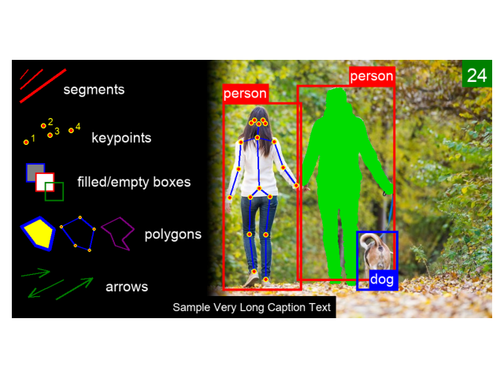

# Fancymages

## Preliminary Note 

**NOTE**: this is a temporary README for this repository, it will be refined at a later moment. In addition, documentation will be provided for this code, once ready.

## Description 

Ever felt like it is the *n-th* time you have to implement bounding box visualization routines or any similar tool? Ever wanted a GPU-accellerated visualization framework which runs as fast as possible and where every single instruction is carefully tailored to perform at its best?

Well, this is not it.

**HOWEVER**, *Fancymages* is something I've been thinking about for a while. A comprehensive visualization library which gathers several visualization functions to help you in speeding up the inspection of your results. Which, we know, are everything that matters!

The code is ever-evolving and will be optimized over time. For now, my focus was about:

- avoiding external dependencies (OpenCV, PyQt, etc.) and relying only on the pillow library
- learning to use @contextmanager and decorators 
- allow the user to specify their own, reusable styles in a simple way

## Sample Output

This is an example of all the visual primitives which is possible to draw within the current version of the library.



To produce the same output, run the following command: 

```bash
python3 src/demo.py
```

## Functionalities

*Fancymages* ships with a set of methods which you can use right away for your need, to draw:

- bounding boxes (together with the corresponding class label)
- segmentation masks
- skeleton-based poses 
- keypoints (each one showing its own label)
- polygons
- arrows
- boxes
- lines

Upcoming features:

- possibility to cycle through colors given a predefined internal colormap (Tableau, etc.)
- more to come